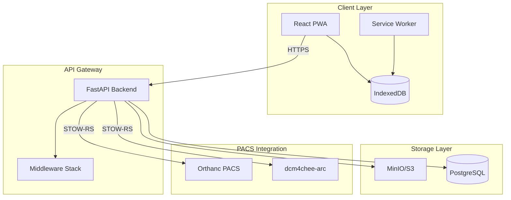
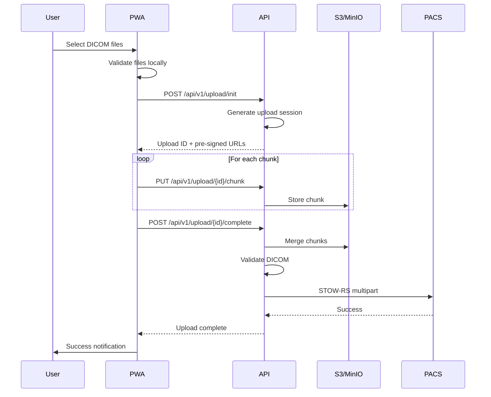
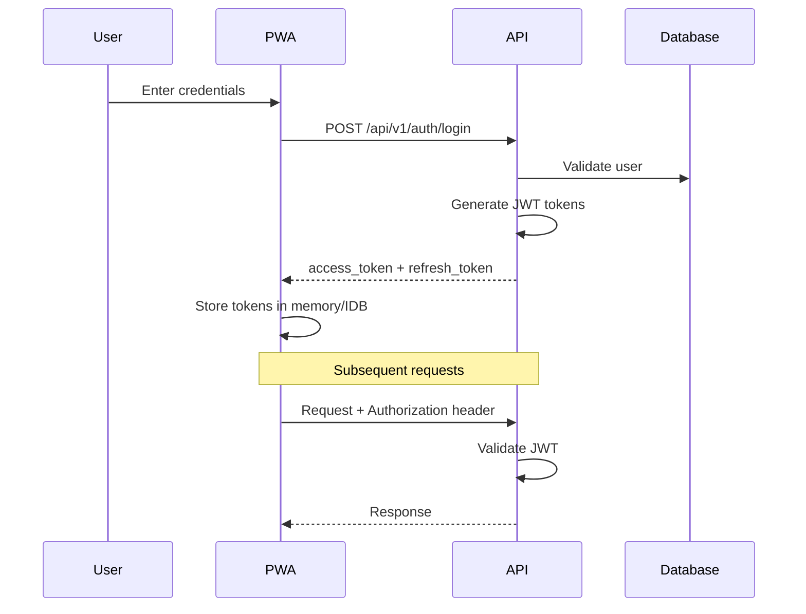
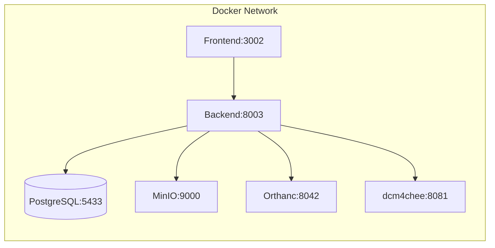
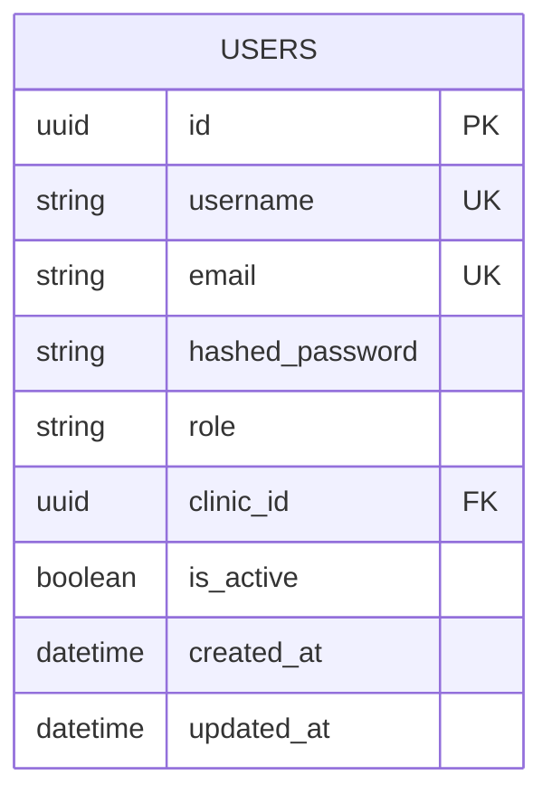

# RelayPACS Architecture Documentation

## Overview

RelayPACS is a mobile-first Progressive Web Application (PWA) for teleradiology DICOM ingestion. It enables clinicians to securely upload medical imaging studies from remote locations for radiological interpretation.

## System Architecture



## Component Architecture

### Frontend (React 19 + Vite)

```
frontend/
├── src/
│   ├── components/       # Reusable UI components
│   │   ├── Layout.tsx    # Main layout with navigation
│   │   ├── FilePreview.tsx
│   │   ├── TrendChart.tsx
│   │   └── notifications/
│   ├── pages/            # Route pages
│   │   ├── Login.tsx
│   │   ├── Dashboard.tsx
│   │   ├── UploadStudy.tsx
│   │   └── Reports.tsx
│   ├── hooks/            # Custom React hooks
│   │   ├── useAuth.ts
│   │   ├── useNetworkStatus.ts
│   │   └── usePWAAppBadge.ts
│   ├── services/         # API service layer
│   └── db/               # IndexedDB (Dexie)
├── e2e/                  # Playwright E2E tests
└── public/               # Static assets
```

### Backend (FastAPI + Python 3.11+)

```
backend/
├── app/
│   ├── api/
│   │   └── v1/           # Versioned API endpoints
│   ├── auth/             # Authentication logic
│   │   ├── router.py     # Auth endpoints
│   │   ├── service.py    # Auth business logic
│   │   └── totp.py       # 2FA support
│   ├── upload/           # Upload handling
│   │   ├── router.py
│   │   ├── manager.py    # Chunk management
│   │   └── storage.py    # S3 integration
│   ├── reports/          # Report management
│   ├── notifications/    # Push notifications
│   ├── pacs/             # PACS integration
│   ├── db/               # Database models
│   ├── middleware/       # Security headers
│   └── config.py         # Settings
├── alembic/              # Database migrations
├── scripts/              # Utility scripts
└── tests/                # pytest test suite
```

## Data Flow

### Upload Workflow



### Authentication Flow



## Technology Stack

| Layer | Technology | Purpose |
|-------|------------|---------|
| Frontend | React 19 | UI Framework |
| Frontend | Vite | Build tool |
| Frontend | TypeScript | Type safety |
| Frontend | Tailwind CSS | Styling |
| Frontend | Dexie | IndexedDB wrapper |
| Backend | FastAPI | API framework |
| Backend | SQLAlchemy | ORM |
| Backend | Alembic | Migrations |
| Backend | Pydantic | Validation |
| Backend | pydicom | DICOM processing |
| Database | PostgreSQL | Primary database |
| Storage | MinIO/S3 | Object storage |
| PACS | Orthanc/dcm4chee | DICOM archive |
| Auth | JWT | Token-based auth |
| Auth | bcrypt | Password hashing |

## Security Architecture

### Authentication & Authorization
- JWT-based authentication with access and refresh tokens
- bcrypt password hashing (cost factor 12)
- Token expiry: 60 min (access), 7 days (refresh)
- Role-based access control (clinician, radiographer, radiologist, admin)

### API Security
- HTTPS enforcement (production)
- CORS with whitelisted origins
- Rate limiting (slowapi)
- Input validation (Pydantic)
- Security headers (CSP, X-Frame-Options, etc.)

### Data Security
- Encrypted storage (S3/MinIO with SSL)
- DICOM data anonymization options
- Audit logging

## Deployment Architecture

### Docker Compose (Local/Dev)



### Service Ports

| Service | Port | Description |
|---------|------|-------------|
| Frontend | 3002 | React PWA (Nginx) |
| Backend | 8003 | FastAPI API |
| PostgreSQL | 5433 | RelayPACS DB |
| MinIO | 9000/9001 | S3 Storage/Console |
| Orthanc | 8042 | PACS Web UI |
| dcm4chee | 8081 | PACS Archive |

## API Versioning

All API endpoints are versioned under `/api/v1/`:

```
/api/v1/auth/login       # Authentication
/api/v1/auth/refresh     # Token refresh
/api/v1/upload/init      # Initialize upload
/api/v1/upload/{id}/chunk # Upload chunk
/api/v1/reports          # Report management
/api/v1/notifications    # Push notifications
```

Legacy endpoints (without prefix) are maintained for backward compatibility.

## Database Schema



## PWA Features

- **Offline Support**: Service worker caches static assets
- **Background Sync**: Failed uploads retry when online
- **App Badge**: Shows pending notification count
- **Install Prompt**: Custom install experience
- **Push Notifications**: Report completion alerts

## Monitoring & Observability

- **Error Tracking**: Sentry integration
- **Metrics**: Prometheus endpoint (planned)
- **Dashboards**: Grafana (planned)
- **Logging**: Structured JSON logs
