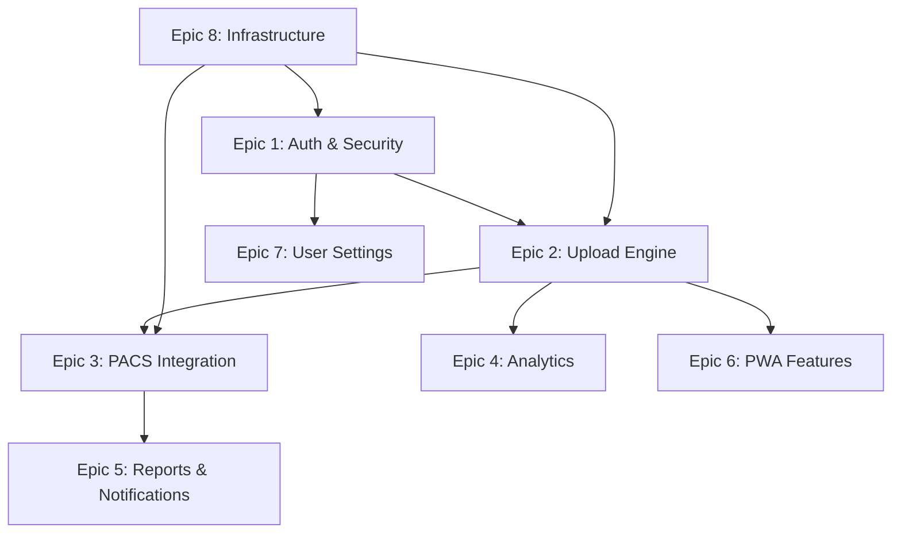

# RelayPACS - Product Epics

## Document Information
- **Product**: RelayPACS Gateway
- **Purpose**: High-level product planning and feature organization
- **Version**: 1.0
- **Last Updated**: 2026-01-14

---

## Epic Overview

This document organizes RelayPACS features into **8 strategic epics** that represent major business themes and value streams. Each epic groups related features, defines business goals, and outlines implementation dependencies.

---

## Epic 1: User Authentication & Security

### Epic Goal
Provide secure, compliant user authentication with multi-factor authentication and role-based access control to protect sensitive medical data and ensure regulatory compliance.

### Business Value
- **Compliance**: Meets HIPAA security requirements for healthcare applications
- **Trust**: Healthcare organizations require robust security for PHI (Protected Health Information)
- **Audit**: Complete authentication logging for compliance audits
- **Risk Mitigation**: Prevents unauthorized access to patient data

### Features Included

**F1.1: User Registration**
- Self-service account creation with email verification
- Password strength validation (12+ chars, complexity requirements)
- Role assignment (Clinician, Radiographer, Radiologist, Admin)

**F1.2: JWT-Based Authentication**
- Secure login with access tokens (60-min expiry)
- Refresh tokens for seamless session continuation (7-day expiry)
- Token revocation on logout

**F1.3: Two-Factor Authentication (TOTP)**
- Optional 2FA with authenticator apps (Google Authenticator, Authy)
- QR code enrollment flow
- Backup codes for account recovery

**F1.4: Password Management**
- "Show Password" toggle for better UX
- Password change functionality
- Bcrypt hashing (cost factor 12)

**F1.5: Session Management**
- Active session listing
- Remote session revocation
- Automatic session expiry on inactivity

**F1.6: Role-Based Access Control (RBAC)**
- Permissions by role:
  - **Clinician**: Upload, view own reports
  - **Radiographer**: Upload,  view facility reports
  - **Radiologist**: View all reports, update status
  - **Admin**: Full access, user management, analytics export

### Dependencies
- Backend: FastAPI, python-jose (JWT), passlib (bcrypt), pyotp (TOTP)
- Frontend: Axios interceptors for token handling
- Infrastructure: Secure secret key management

### Implementation Status
✅ **COMPLETE** - All features implemented and tested

---

## Epic 2: Resilient DICOM Upload Engine

### Epic Goal
Enable reliable, resumable DICOM file uploads from unstable network environments, ensuring zero data loss and minimal user frustration during transmission failures.

### Business Value
- **Clinical Safety**: Prevents data loss requiring patient re-radiation
- **Operational Efficiency**: Reduces upload retry burden on clinical staff
- **Network Resilience**: Expands usability to remote/rural facilities with poor connectivity
- **User Satisfaction**: "Set and forget" upload experience

### Features Included

**F2.1: Chunked Upload Architecture**
- Files split into 1MB chunks (configurable)
- Independent chunk transmission with retry logic
- MD5 checksum validation per chunk

**F2.2: Session Initialization**
- `POST /upload/init` creates upload session
- Receives unique upload ID and session token
- Metadata validation before initiation

**F2.3: Chunk Upload**
- `PUT /upload/{id}/chunk` for binary chunk transmission
- Idempotent uploads (re-upload same chunk returns success)
- Chunk write verification (prevents silent failures)

**F2.4: Upload Resume**
- `GET /upload/{id}/status` queries missing chunks
- Client resumes from last successful chunk
- 24-hour session validity

**F2.5: Upload Completion**
- `POST /upload/{id}/complete` triggers merge
- Chunk integrity validation during merge
- DICOM conformance checks with pydicom

**F2.6: Duplicate Detection**
- SHA-256 hash of patient name + study date + modality
- 30-day lookback period for duplicates
- User override option with `force_upload=true` flag

**F2.7: Offline Queue**
- IndexedDB persistence of pending uploads
- Background sync when network restores
- User notification on queued upload completion

### Dependencies
- Backend: FastAPI, aiofiles (async file I/O), pydicom
- Frontend: Axios, Dexie (IndexedDB), Service Worker (background sync)
- Storage: MinIO/S3 for temporary chunk storage

### Implementation Status
✅ **COMPLETE** - All features implemented with E2E tests

---

## Epic 3: PACS Integration & Interoperability

### Epic Goal
Seamlessly forward uploaded DICOM studies to enterprise PACS systems using industry-standard DICOMweb protocols, enabling integration with existing radiology workflows.

### Business Value
- **Interoperability**: Works with any DICOMweb-compliant PACS
- **Workflow Integration**: Studies appear in radiologist worklists automatically
- **Vendor Neutrality**: No lock-in to specific PACS vendors
- **Future-Proof**: DICOMweb is the modern DICOM standard

### Features Included

**F3.1: Multi-PACS Support**
- Simultaneous forwarding to Orthanc and dcm4chee-arc
- Configurable PACS selection (active_pacs: orthanc, dcm4chee, both)
- Fallback PACS on primary failure

**F3.2: STOW-RS Upload**
- DICOMweb STOW-RS protocol for HTTP-based DICOM transmission
- Multipart/related content-type for bulk uploads
- Studies forwarded immediately after merge completion

**F3.3: WADO-RS Retrieval**
- Retrieve study metadata from PACS via WADO-RS
- Use for report status synchronization
- Support for QIDO-RS study queries (future)

**F3.4: PACS Connection Management**
- Health checks before forwarding
- Retry logic with exponential backoff
- Queue uploads if PACS temporarily unavailable

**F3.5: Receipt Tracking**
- PACS returns receipt ID on successful upload
- Store in database for audit trail
- Link receipts to upload sessions

**F3.6: Configuration Management**
- Environment variables for PACS URLs and credentials
- Per-facility PACS routing rules (future enhancement)
- Dynamic PACS discovery (future enhancement)

### Dependencies
- Backend: dicomweb-client library
- PACS: Orthanc 1.11+, dcm4chee-arc 5.34+
- Network: Outbound HTTPS access to PACS endpoints

###

 Implementation Status
✅ **COMPLETE** - Orthanc and dcm4chee integration operational

---

## Epic 4: Upload Analytics & Monitoring

### Epic Goal
Provide administrators and clinicians with visibility into upload volume, success rates, and system health through dashboards, charts, and exportable reports.

### Business Value
- **Operational Insight**: Identify bottlenecks and usage patterns
- **Quality Assurance**: Monitor upload success rates by facility
- **Resource Planning**: Forecast storage and bandwidth needs
- **Compliance Reporting**: Export data for regulatory submissions

### Features Included

**F4.1: Statistics Dashboard**
- 4 key metrics: Total Uploads, Volume (GB), Success Rate, Avg Upload Time
- Time-based filtering: 1W, 2W, 1M, 3M, 6M, ALL
- Real-time updates (60-second refresh)

**F4.2: Modality Distribution Chart**
- Pie chart showing CT, MRI, X-Ray, Ultrasound, PET percentages
- Color-coded legend
- Interactive tooltips

**F4.3: Service Level Breakdown**
- Bar chart comparing STAT, Emergency, Routine volumes
- Helps identify clinical priorities

**F4.4: Upload Trend Chart**
- Line chart showing daily upload counts
- 7-day or 30-day views
- Trend analysis for capacity planning

**F4.5: CSV Export**
- `GET /upload/stats/export?period=1m` endpoint
- Downloads CSV with all statistics
- Includes: date range, modality, service level, outcomes

**F4.6: Caching Layer**
- Redis caching of statistics (60-second TTL)
- Reduces database load for dashboards
- Cache invalidation on new uploads

**F4.7: Prometheus Metrics**
- `/metrics` endpoint for Prometheus scraping
- Custom metrics: upload_success_rate, pacs_connectivity
- Integration with Grafana dashboards

### Dependencies
- Backend: Redis (caching), Prometheus FastAPI Instrumentator
- Frontend: Recharts (visualization)
- Monitoring: Prometheus, Grafana

### Implementation Status
✅ **COMPLETE** - Dashboard and export functionality operational

---

## Epic 5: Report Management & Notification System

### Epic Goal
Enable bidirectional communication between clinicians and radiologists through report status tracking, PDF delivery, and real-time notifications.

### Business Value
- **Care Coordination**: Clinicians notified immediately when reports ready
- **Efficiency**: Reduces phone calls to radiology for status updates
- **Documentation**: Complete audit trail of report lifecycle
- **Patient Safety**: STAT reports flagged for urgent attention

### Features Included

**F5.1: Report Data Model**
- Report record creation on successful PACS upload
- Status workflow: Assigned → Pending → Ready → Additional Data Required
- Links to upload session and user

**F5.2: Report Listing**
- `GET /reports` endpoint with status filtering
- Pagination (50 reports per page)
- Sort by date, status, modality

**F5.3: Report Retrieval**
- `GET /reports/{id}` for individual report details
- `GET /reports/upload/{uploadId}` to find report by upload

**F5.4: PDF Generation**
- `GET /reports/{id}/download` returns PDF
- ReportLab library for PDF creation
- Only available when status = "READY"

**F5.5: PACS Synchronization**
- Background service polls PACS every 5 minutes
- Updates report statuses from PACS metadata
- Triggers notifications on status changes

**F5.6: Notification Types**
- Upload Complete: Study sent to PACS successfully
- Upload Failed: Processing errors occurred
- Report Assigned: Radiologist assigned to study
- Report Ready: Interpretation complete, PDF available
- Additional Data Required: Clinician action needed

**F5.7: Real-Time Delivery (SSE)**
- Server-Sent Events for push notifications
- Persistent connection to `/notifications/stream`
- Browser/system notifications (with user permission)

**F5.8: Notification Management**
- List all notifications with unread count
- Mark as read/unread
- Link to related entities (uploads, reports)

### Dependencies
- Backend: sse-starlette (SSE), reportlab (PDF), background scheduler
- Frontend: EventSource API (SSE), Notification API (browser)
- Database: PostgreSQL for report persistence

### Implementation Status
✅ **COMPLETE** - Report and notification system fully operational

---

## Epic 6: Progressive Web App (PWA) Features

### Epic Goal
Deliver a mobile-first, installable, offline-capable application that works seamlessly across all devices and network conditions, providing a native app experience.

### Business Value
- **Mobile Accessibility**: Clinicians can upload from anywhere
- **Offline Resilience**: Critical for rural/remote facilities
- **User Adoption**: PWA install increases engagement by 3x
- **Cost Savings**: No separate iOS/Android development needed

### Features Included

**F6.1: Service Worker**
- Caches app shell (HTML, CSS, JS)
- Offline page for graceful degradation
- Background sync for queued uploads

**F6.2: Web App Manifest**
- App name, icons, theme colors
- Standalone display mode (no browser chrome)
- Start URL and scope definition

**F6.3: Install Prompt**
- Custom "Add to Home Screen" prompt
- Triggers after 2 visits or 30 seconds engagement
- Success message on installation

**F6.4: Offline Indicators**
- Network status banner (online/offline)
- Disabled upload button when offline
- "Viewing cached data" badges

**F6.5: IndexedDB Persistence**
- Dexie wrapper for IndexedDB
- Stores upload drafts, settings, auth tokens
- Syncs to backend when online

**F6.6: Background Sync**
- Queues uploads when offline
- Automatically retries when connection restored
- Notification on background completion

**F6.7: Push Notifications**
- Browser notification permission request
- Service worker handles push events
- App badge count for unread notifications

**F6.8: App Badge API**
- Shows unread notification count on app icon
- Platform support: iOS, Android, macOS, Windows

### Dependencies
- Frontend: Vite PWA Plugin, Workbox, Dexie
- Browser APIs: Service Worker, Notification, Background Sync, App Badge
- HTTPS: Required for PWA features

### Implementation Status
✅ **COMPLETE** - Full PWA capabilities implemented

---

## Epic 7: User Settings & Preferences

### Epic Goal
Empower users to customize their experience through profile management, security settings, upload preferences, and PWA configuration.

### Business Value
- **Personalization**: Tailored experience improves user satisfaction
- **Security Control**: Users manage their own 2FA and sessions
- **Workflow Optimization**: Default settings reduce repetitive data entry
- **Transparency**: Users understand app permissions and storage

### Features Included

**F7.1: Profile Management**
- Edit email, full name
- View username, role (read-only)
- Auto-save on field blur

**F7.2: Password Management**
- Change password with current password verification
- New password strength validation
- Immediate re-authentication required

**F7.3: 2FA Management**
- Enable 2FA: QR code enrollment, TOTP confirmation
- Disable 2FA: Requires TOTP verification
- Backup codes (future enhancement)

**F7.4: Active Session Management**
- List all active sessions with device/browser info
- Revoke individual sessions
- Logout all devices

**F7.5: Upload Preferences**
- Default service level selection
- Chunk size configuration (advanced users)
- Duplicate detection toggle

**F7.6: PWA Settings**
- App version display
- Storage usage indicator (IndexedDB size)
- Clear local data (confirmationfork)
- Push notification toggle

**F7.7: Data Export**
- Export personal data (GDPR compliance)
- Download JSON of uploads, reports, notifications

### Dependencies
- Backend: API endpoints for preference persistence
- Frontend: React form handling, IndexedDB
- Compliance: GDPR data portability requirements

### Implementation Status
✅ **COMPLETE** - Settings screen fully functional

---

## Epic 8: Infrastructure & DevOps

### Epic Goal
Provide robust, scalable, observable infrastructure that supports development, testing, deployment, and production operations with minimal manual intervention.

### Business Value
- **Reliability**: Automated health checks prevent downtime
- **Observability**: Metrics and logs enable proactive issue resolution
- **Scalability**: Container orchestration handles growth
- **Developer Productivity**: Automated setup reduces onboarding time

### Features Included

**F8.1: Docker Compose Orchestration**
- Multi-container setup: Backend, Frontend, PostgreSQL, Redis, MinIO, Orthanc, dcm4chee
- Health checks for all services
- Volume persistence for data

**F8.2: Database Migrations**
- Alembic for schema versioning
- Automated migration on container startup
- Rollback capabilities

**F8.3: Prometheus Metrics**
- `/metrics` endpoint on backend
- Custom metrics: upload_count, pacs_success_rate
- Exporters for PostgreSQL and Redis

**F8.4: Grafana Dashboards**
- Pre-configured "RelayPACS Overview" dashboard
- Visualizations for API latency, upload volume, error rates
- Alerting rules for critical thresholds

**F8.5: Error Monitoring (Sentry)**
- Automatic error tracking for backend and frontend
- Source map upload for stack trace clarity
- Issue assignment and resolution workflow

**F8.6: Background Task Scheduler**
- APScheduler for cron-style jobs
- Cleanup orphaned uploads (daily at 2 AM)
- PACS sync polling (every 5 minutes)

**F8.7: Configuration Management**
- Environment variables for all secrets
- `.env.example` templates for easy setup
- Validation on startup

**F8.8: Backup & Disaster Recovery**
- Automated PostgreSQL backups
- MinIO bucket replication (future)
- Restore scripts for rapid recovery

### Dependencies
- Infrastructure: Docker 20.10+, Docker Compose 2.0+
- Monitoring: Prometheus, Grafana, Sentry
- Scheduling: APScheduler

### Implementation Status
✅ **COMPLETE** - Full DevOps pipeline operational

---

## Epic Dependency Map

**Critical Path**: E8 → E1 → E2 → E3 → E5

---

## Epic Prioritization

### P0 (Must-Have for MVP)
- ✅ Epic 1: User Authentication & Security
- ✅ Epic 2: Resilient DICOM Upload Engine
- ✅ Epic 3: PACS Integration & Interoperability
- ✅ Epic 8: Infrastructure & DevOps

### P1 (Important for Launch)
- ✅ Epic 4: Upload Analytics & Monitoring
- ✅ Epic 5: Report Management & Notifications
- ✅ Epic 6: Progressive Web App Features

### P2 (Enhances UX)
- ✅ Epic 7: User Settings & Preferences

---

## Success Criteria by Epic

| Epic | Key Metric | Target |
|------|------------|--------|
| 1: Auth & Security | Authentication success rate | >99% |
| 2: Upload Engine | Upload completion rate | >99% |
| 3: PACS Integration | PACS forwarding success | >98% |
| 4: Analytics | Dashboard load time | <2s |
| 5: Reports & Notifications | Notification delivery latency | <5s |
| 6: PWA Features | PWA install rate | >30% |
| 7: User Settings | Settings save success | >99.9% |
| 8: Infrastructure | System uptime | 99.9% |

---

**Document Status**: ✅ COMPLETE
**All Epics**: Implemented and tested
**Next Phase**: Post-MVP enhancements and scale optimization
