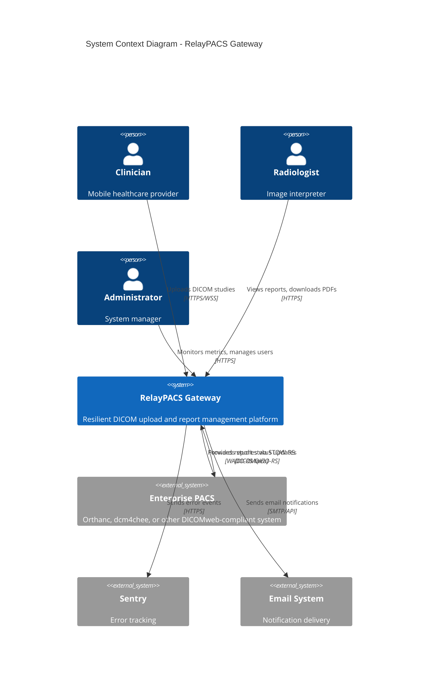
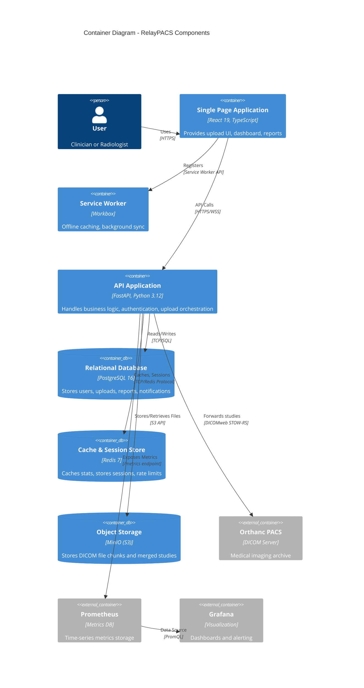
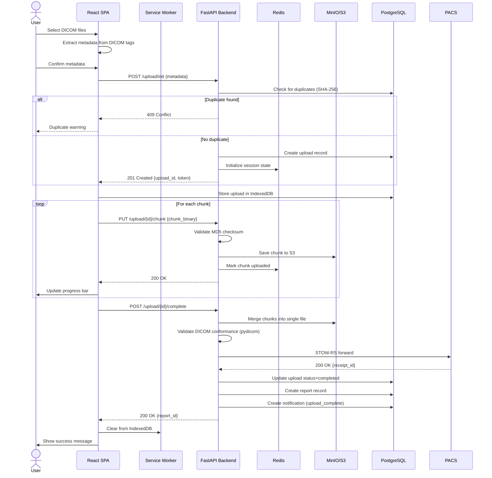
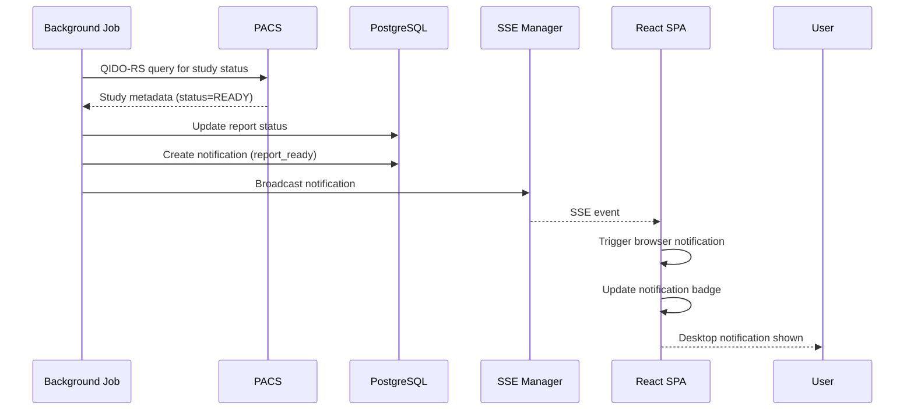
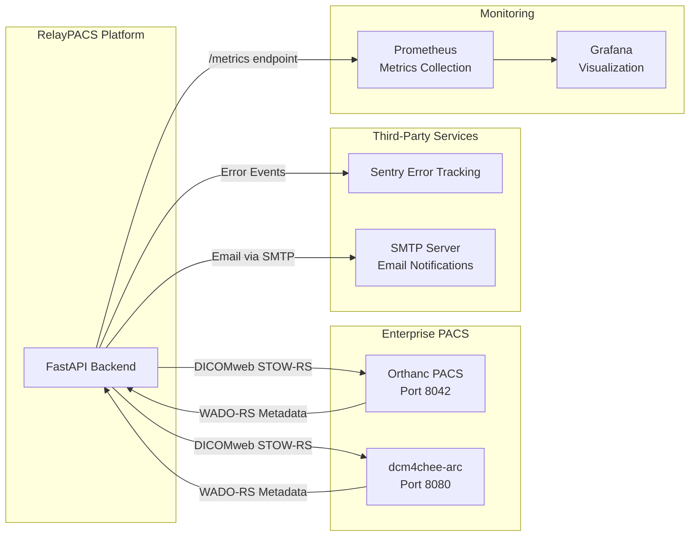
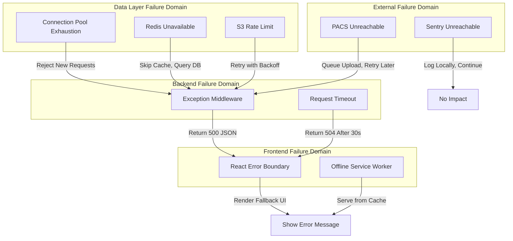

# System and Component Architecture

## Document Information
- **Product**: RelayPACS Gateway
- **Purpose**: High-level system design and component interaction
- **Version**: 1.0
- **Last Updated**: 2026-01-14

---

## Table of Contents
1. [Architecture Overview](#architecture-overview)
2. [Component Model](#component-model)
3. [Data Flow](#data-flow)
4. [Integration Architecture](#integration-architecture)
5. [Failure Boundaries](#failure-boundaries)
6. [Scalability Design](#scalability-design)

---

## Architecture Overview

### System Context

RelayPACS is a **medical imaging gateway** that bridges the gap between remote/mobile clinicians and enterprise PACS systems. It addresses the "last mile" problem of unreliable network connectivity in healthcare settings.

**System Context Diagram**:



### Architectural Style

**Pattern**: **Microservices-oriented monolith**
- Modular codebase organized by domain (auth, upload, reports, notifications)
- Deployable as single unit (simplifies initial operations)
- Clear service boundaries enable future decomposition
- Shared database (PostgreSQL) with schema isolation per module

**Architecture Characteristics**:
- **Availability**: 99.9% uptime target
- **Performance**: <500ms API latency (P95)
- **Scalability**: Horizontal pod scaling (2-10 replicas)
- **Security**: HIPAA-compliant data handling
- **Resilience**: Graceful degradation on component failure

---

## Component Model

### Container Diagram



### Component Responsibilities

#### 1. Frontend (React SPA)

**Module**: `frontend/src/`

**Responsibilities**:
- User interface rendering
- Client-side routing
- Form validation
- Local data persistence (IndexedDB)
- Real-time notification display (SSE client)
- Offline queue management

**Key Sub-Components**:
- **Pages**: Screen components (`Login`, `UploadStudy`, `Dashboard`, etc.)
- **Hooks**: Reusable logic (`useAuth`, `useNetworkStatus`, `useUpload`)
- **Services**: API clients (`api.ts`, `uploadService.ts`)
- **DB**: IndexedDB schema (Dexie wrapper)

**Technology**: React 19, TypeScript, Vite, Tailwind CSS, Dexie

---

#### 2. Service Worker

**Module**: `frontend/public/sw.js` (generated by Vite PWA Plugin)

**Responsibilities**:
- App shell caching (HTML, CSS, JS)
- Runtime caching (API responses)
- Background sync for queued uploads
- Push notification handling
- Offline page serving

**Caching Strategies**:
- **App Shell**: Cache-first (1-year cache)
- **API Responses**: Network-first with cache fallback
- **Static Assets**: Cache-first with version validation

---

#### 3. Backend API

**Module**: `backend/app/`

**Responsibilities**:
- Authentication & authorization
- Upload session management
- DICOM file processing
- PACS integration
-Report lifecycle management
- Notification delivery
- Analytics computation

**Domain Modules** (FastAPI routers):

```
app/
├── auth/          # JWT, TOTP, user management
├── upload/        # Session init, chunk upload, completion
├── reports/       # Report CRUD, PDF generation, PACS sync
├── notifications/ # SSE stream, notification CRUD
├── pacs/          # DICOMweb client integration
├── dicom/         # DICOM parsing and validation
├── storage/       # MinIO/S3 abstraction
├── tasks/         # Background jobs (cleanup, sync)
├── database/      # SQLAlchemy models, session management
├── middleware/    # CORS, rate limiting, error handling
└── models/        # Pydantic schemas (API contracts)
```

**Technology**: FastAPI, SQLAlchemy, pydicom, Boto3, APScheduler

---

#### 4. PostgreSQL Database

**Module**: Relational persistence

**Responsibilities**:
- User account storage
- Upload metadata tracking
- Report lifecycle state
- Notification storage
- Audit logging

**Schema**:
```sql
users
  - id (UUID, PK)
  - username (unique)
  - password_hash (bcrypt)
  - totp_secret (encrypted, nullable)
  - role (enum: clinician, radiologist, admin)

uploads
  - id (UUID, PK)
  - user_id (FK → users)
  - study_hash (SHA-256 for duplicate detection)
  - metadata (JSON: patient name, study date, modality)
  - status (enum: pending, completed, failed)
  - chunk_count, uploaded_chunks (array)
  - created_at, completed_at

reports
  - id (UUID, PK)
  - upload_id (FK → uploads)
  - status (enum: assigned, pending, ready)
  - radiologist_id (FK → users, nullable)
  - pdf_url (S3 path, nullable)
  - pacs_receipt_id (nullable)

notifications
  - id (UUID, PK)
  - user_id (FK → users)
  - type (enum: upload_complete, report_ready, etc.)
  - related_id (UUID, polymorphic to upload/report)
  - is_read (boolean)
  - created_at
```

---

#### 5. Redis Cache

**Module**: In-memory key-value store

**Responsibilities**:
- Upload session state (temporary storage during upload)
- Statistics caching (60-second TTL)
- Rate limiting counters (per-user, per-IP)
- Refresh token blacklist (on logout)

**Data Structures**:
```
session:{upload_id} → hash of upload metadata
stats:{period}      → cached analytics JSON
rate:{user_id}      → request count (expire 60s)
blacklist:{token}   → revoked refresh token (expire 7d)
```

---

#### 6. MinIO Object Storage

**Module**: S3-compatible object storage

**Responsibilities**:
- DICOM file chunk storage during upload
- Merged DICOM study files
- Generated PDF reports
- Lifecycle management (archive old files)

**Bucket Structure**:
```
uploads-bucket/
  {upload_id}/
    chunks/
      file-001_chunk-0.bin
      file-001_chunk-1.bin
    merged/
      file-001.dcm

reports-bucket/
  {report_id}.pdf
```

---

#### 7. PACS Integration Service

**Module**: `backend/app/pacs/`

**Responsibilities**:
- Forward merged DICOM files to PACS via STOW-RS
- Retrieve report status via WADO-RS/QIDO-RS
- Handle PACS connectivity failures (retry logic)
- Support multiple PACS targets (Orthanc, dcm4chee)

**DICOMweb Endpoints Used**:
- `POST /dicom-web/studies` (STOW-RS upload)
- `GET /dicom-web/studies/{uid}` (WADO-RS metadata retrieval)

---

#### 8. Background Scheduler

**Module**: `backend/app/tasks/`

**Responsibilities**:
- Orphaned upload cleanup (daily at 2 AM)
- Expired session cleanup
- PACS report synchronization (every 5 minutes)
- Analytics pre-computation (hourly)

**Jobs**:
```python
@scheduler.scheduled_job('cron', hour=2, minute=0)
async def cleanup_orphaned_uploads():
    # Delete sessions older than 24 hours with no activity
    pass

@scheduler.scheduled_job('interval', minutes=5)
async def sync_report_status_from_pacs():
    # Query PACS for updated report statuses
    # Update database and trigger notifications
    pass
```

---

## Data Flow

### Upload Workflow Sequence



### Report Status Update Flow



---

## Integration Architecture

### External System Connections



### Integration Patterns

**PACS Integration** (DICOMweb):
- **Protocol**: HTTPS with Basic Auth or OAuth2
- **Data Format**: Multipart/related with DICOM Part 10 files
- **Retry Strategy**: Exponential backoff (3 retries, 1s/2s/4s delays)
- **Circuit Breaker**: Open after 5 consecutive failures (reset after 60s)

**Error Tracking** (Sentry):
- **Protocol**: HTTPS POST to Sentry DSN
- **Payload**: JSON with error context, stack trace, user context
- **Sampling**: 100% errors, 10% performance traces
- **Releases**: Tagged with git SHA for source map resolution

---

## Failure Boundaries

### Failure Isolation

**Failure Domain Map**:



### Graceful Degradation

| Failure Scenario | Impact | Degradation Strategy |
|------------------|--------|---------------------|
| **PostgreSQL down** | Critical | Return 503, block all writes, serve cached reads for 5 minutes |
| **Redis down** | Medium | Skip caching, direct DB queries (slower) |
| **MinIO down** | High | Reject new uploads, allow status checks |
| **PACS unreachable** | Medium | Queue uploads in DB, retry every 5 minutes |
| **Sentry down** | Low | Log errors to stdout, continue operations |
| **Service Worker broken** | Low | App still works, no offline support |

---

## Scalability Design

### Horizontal Scaling Strategy

**Stateless Components** (easy to scale):
- **Backend API**: 2-10 replicas (load balanced)
- **Frontend SPA**: Served from CDN (infinite scale)

**Stateful Components** (scale with care):
- **PostgreSQL**: Vertical scaling + read replicas
- **Redis**: Cluster mode (sharding)
- **MinIO**: Distributed mode (multi-server)

### Bottleneck Analysis

**Potential Bottlenecks**:
1. **Database Connections**: Limit 100 connections
   - **Mitigation**: Connection pooling (PgBouncer), optimize query patterns

2. **File Upload Bandwidth**: Network I/O to MinIO
   - **Mitigation**: Distribute chunk uploads across availability zones

3. **PACS Forwarding**: PACS may have concurrent upload limits
   - **Mitigation**: Queue-based forwarding with concurrency limit (5 parallel)

4. **SSE Connections**: Each connected client holds a persistent connection
   - **Mitigation**: Sticky sessions, scale API horizontally, use Redis pub/sub for notifications

---

**Document Status**: ✅ COMPLETE
**Maintained By**: Principal Engineer
**Review Frequency**: Quarterly or after major architectural changes
