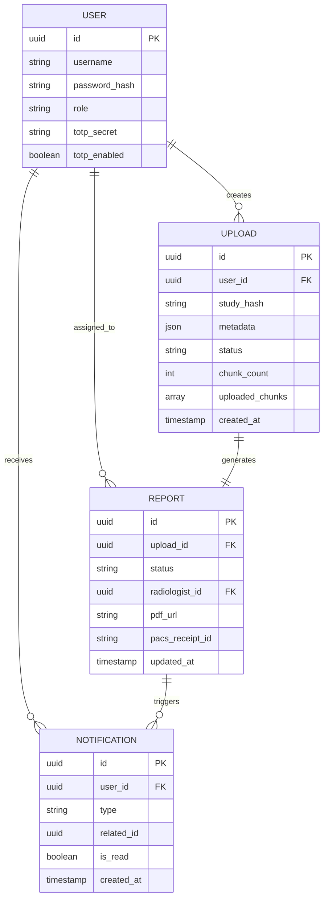
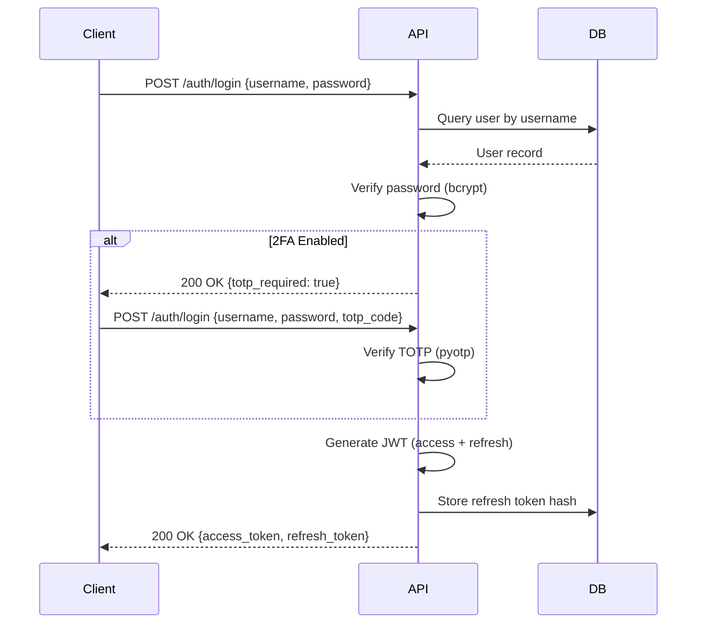

# Technical Design Specification

## Document Information
- **Product**: RelayPACS Gateway
- **Purpose**: Deep technical blueprint for engineering implementation
- **Version**: 1.0
- **Last Updated**: 2026-01-14

---

## Table of Contents
1. [Technology Choices](#technology-choices)
2. [Design Patterns](#design-patterns)
3. [Data Models](#data-models)
4. [API Contracts](#api-contracts)
5. [Error Handling](#error-handling)
6. [Performance Considerations](#performance-considerations)
7. [Security Design](#security-design)

---

## Technology Choices

### Backend Stack

**Framework**: FastAPI 0.128+
- **Rationale**: Modern async Python framework with automatic OpenAPI documentation, high performance, and excellent type safety
- **Alternatives Considered**: Django REST Framework (too heavyweight), Flask (lacks async, validation)

**Database ORM**: SQLAlchemy 2.0+
- **Rationale**: Industry-standard ORM with async support, type-safe queries, migration tooling (Alembic)
- **Patterns**: Repository pattern for data access abstraction

**Validation**: Pydantic 2.0+
- **Rationale**: Integrated with FastAPI, runtime type validation, JSON schema generation
- **Usage**: API request/response models, configuration validation

**DICOM Processing**: pydicom 2.4+
- **Rationale**: Pure Python DICOM parser, no external dependencies, extensive tag support
- **Usage**: Metadata extraction, file validation

**Object Storage Client**: Boto3 1.34+
- **Rationale**: AWS SDK compatible with MinIO (S3-compatible), battle-tested
- **Configuration**: Custom endpoint URL for MinIO

**Task Scheduling**: APScheduler 3.10+
- **Rationale**: Python-native, supports cron and interval jobs, background task execution
- **Usage**: Orphaned upload cleanup, PACS synchronization

### Frontend Stack

**Framework**: React 19
- **Rationale**: Component-based architecture, large ecosystem, PWA support via plugins
- **State Management**: Context API + custom hooks (no Redux needed for this scale)

**Build Tool**: Vite 7
- **Rationale**: Fast HMR, optimized production builds, modern ESM-based
- **Plugins**: vite-plugin-pwa for service worker generation

**Styling**: Tailwind CSS 3.4+
- **Rationale**: Utility-first CSS, minimal bundle size (tree-shaking), design consistency
- **Configuration**: Custom color palette, mobile-first breakpoints

**Data Persistence**: Dexie 4.0+
- **Rationale**: IndexedDB wrapper with intuitive API, schema versioning, TypeScript support
- **Usage**: Offline upload queue, user preferences, auth tokens

**Charts**: Recharts 2.12+
- **Rationale**: React-native chart library, declarative API, responsive
- **Usage**: Analytics dashboard (pie, bar, line charts)

**Testing**: Playwright 1.43+
- **Rationale**: Cross-browser E2E testing, auto-wait, video/screenshot capture
- **Coverage**: Critical user flows (login, upload, reports)

### Infrastructure

**Containerization**: Docker 26+, Docker Compose 2.27+
- **Rationale**: Environment consistency, easy local development, production-ready
- **Base Images**: python:3.12-slim, node:20-alpine, postgres:16-alpine

**Orchestration (Production)**: Kubernetes 1.29+
- **Rationale**: Industry standard, auto-scaling, self-healing, declarative configuration
- **Managed Services**: EKS (AWS), GKE (GCP), AKS (Azure)

**Monitoring**: Prometheus 2.50+ + Grafana 10.4+
- **Rationale**: Open-source, time-series metrics, powerful query language (PromQL)
- **Exporters**: FastAPI instrumentator, postgres_exporter, redis_exporter

---

## Design Patterns

### Backend Patterns

#### 1. Repository Pattern

**Purpose**: Abstract data access logic from business logic

**Implementation**:
```python
# app/repositories/user_repository.py
from sqlalchemy.ext.asyncio import AsyncSession
from app.database.models import User

class UserRepository:
    def __init__(self, session: AsyncSession):
        self.session = session

    async def get_by_username(self, username: str) -> User | None:
        result = await self.session.execute(
            select(User).where(User.username == username)
        )
        return result.scalar_one_or_none()

    async def create(self, user: User) -> User:
        self.session.add(user)
        await self.session.commit()
        await self.session.refresh(user)
        return user
```

**Usage**:
```python
@router.post("/register")
async def register(data: UserCreate, session: AsyncSession = Depends(get_session)):
    repo = UserRepository(session)
    existing = await repo.get_by_username(data.username)
    if existing:
        raise HTTPException(400, "Username already exists")

    user = User(username=data.username, password_hash=hash_password(data.password))
    return await repo.create(user)
```

#### 2. Service Layer Pattern

**Purpose**: Encapsulate business logic separate from API routing

**Implementation**:
```python
# app/services/upload_service.py
class UploadService:
    def __init__(
        self,
        storage: StorageService,
        pacs: PacsService,
        repo: UploadRepository
    ):
        self.storage = storage
        self.pacs = pacs
        self.repo = repo

    async def complete_upload(self, upload_id: UUID) -> UploadResult:
        # Business logic here
        chunks = await self.storage.get_chunks(upload_id)
        merged_file = await self.storage.merge_chunks(chunks)

        # Validate DICOM
        if not self.validate_dicom(merged_file):
            raise DicomValidationError()

        # Forward to PACS
        receipt = await self.pacs.forward_file(merged_file)

        # Update database
        await self.repo.mark_complete(upload_id, receipt_id=receipt)

        return UploadResult(success=True, receipt_id=receipt)
```

#### 3. Dependency Injection

**Purpose**: Loose coupling, testability

**FastAPI Implementation**:
```python
# app/dependencies.py
async def get_upload_service(
    session: AsyncSession = Depends(get_session),
    storage: StorageService = Depends(get_storage_service),
    pacs: PacsService = Depends(get_pacs_service)
) -> UploadService:
    repo = UploadRepository(session)
    return UploadService(storage, pacs, repo)

# app/upload/router.py
@router.post("/{upload_id}/complete")
async def complete_upload(
    upload_id: UUID,
    service: UploadService = Depends(get_upload_service)
):
    return await service.complete_upload(upload_id)
```

### Frontend Patterns

#### 1. Custom Hooks Pattern

**Purpose**: Reusable stateful logic

**Example - useAuth**:
```typescript
// hooks/useAuth.ts
export const useAuth = () => {
  const [user, setUser] = useState<User | null>(null);
  const [isAuthenticated, setIsAuthenticated] = useState(false);

  useEffect(() => {
    // Check for stored token on mount
    const checkAuth = async () => {
      const token = await db.authTokens.get(1);
      if (token && !isExpired(token.access_token)) {
        setUser(decodeToken(token.access_token));
        setIsAuthenticated(true);
      }
    };
    checkAuth();
  }, []);

  const login = async (username: string, password: string) => {
    const response = await api.post('/auth/login', { username, password });
    await db.authTokens.put({ id: 1, ...response.data });
    setUser(decodeToken(response.data.access_token));
    setIsAuthenticated(true);
  };

  return { user, isAuthenticated, login, logout };
};
```

#### 2. Compound Component Pattern

**Purpose**: Related components share state without prop drilling

**Example - Upload Progress**:
```typescript
// components/UploadProgress/index.tsx
const UploadProgressContext = createContext<UploadState | null>(null);

export const UploadProgress = ({ uploadId }: Props) => {
  const [state, setState] = useState<UploadState>(/* ... */);

  return (
    <UploadProgressContext.Provider value={state}>
      <div className="upload-progress">
        {children}
      </div>
    </UploadProgressContext.Provider>
  );
};

UploadProgress.Header = () => {
  const { uploadedBytes, totalBytes } = useContext(UploadProgressContext);
  return <div>{uploadedBytes} / {totalBytes} MB</div>;
};

UploadProgress.FileList = () => {
  const { files } = useContext(UploadProgressContext);
  return <ul>{files.map(f => <li key={f.id}>{f.name}</li>)}</ul>;
};
```

---

## Data Models

### Conceptual Domain Model



### SQLAlchemy Models (Actual Implementation)

```python
# app/database/models.py
from sqlalchemy import Column, String, Boolean, DateTime, ForeignKey, Enum, ARRAY
from sqlalchemy.dialects.postgresql import UUID, JSON
from sqlalchemy.orm import relationship
import enum

class UserRole(str, enum.Enum):
    CLINICIAN = "clinician"
    RADIOGRAPHER = "radiographer"
    RADIOLOGIST = "radiologist"
    ADMIN = "admin"

class User(Base):
    __tablename__ = "users"

    id = Column(UUID(as_uuid=True), primary_key=True, default=uuid.uuid4)
    username = Column(String(50), unique=True, nullable=False, index=True)
    email = Column(String(255), nullable=True)
    password_hash = Column(String(255), nullable=False)
    role = Column(Enum(UserRole), nullable=False, default=UserRole.CLINICIAN)
    totp_secret = Column(String(255), nullable=True)  # Encrypted
    totp_enabled = Column(Boolean, default=False)
    created_at = Column(DateTime(timezone=True), server_default=func.now())

    uploads = relationship("Upload", back_populates="user")
    notifications = relationship("Notification", back_populates="user")

class UploadStatus(str, enum.Enum):
    PENDING = "pending"
    UPLOADING = "uploading"
    COMPLETED = "completed"
    FAILED = "failed"

class Upload(Base):
    __tablename__ = "uploads"

    id = Column(UUID(as_uuid=True), primary_key=True, default=uuid.uuid4)
    user_id = Column(UUID(as_uuid=True), ForeignKey("users.id"), nullable=False)
    study_hash = Column(String(64), nullable=False, index=True)  # SHA-256
    metadata = Column(JSON, nullable=False)  # Patient name, study date, modality, etc.
    status = Column(Enum(UploadStatus), nullable=False, default=UploadStatus.PENDING)
    chunk_count = Column(Integer, nullable=False)
    uploaded_chunks = Column(ARRAY(Integer), default=[])
    created_at = Column(DateTime(timezone=True), server_default=func.now())
    completed_at = Column(DateTime(timezone=True), nullable=True)

    user = relationship("User", back_populates="uploads")
    report = relationship("Report", back_populates="upload", uselist=False)
```

### Pydantic Schemas (API Contracts)

```python
# app/models/upload.py
from pydantic import BaseModel, Field, validator
from datetime import datetime
from uuid import UUID

class StudyMetadata(BaseModel):
    patient_name: str = Field(..., min_length=1, max_length=100)
    study_date: str = Field(..., regex=r"^\d{8}$")  # YYYYMMDD
    modality: str = Field(..., regex=r"^(CT|MRI|XR|US|PET|OTHER)$")
    service_level: str = Field("routine", regex=r"^(stat|emergency|routine|subspecialty)$")
    clinical_history: str | None = Field(None, max_length=500)

class UploadInitRequest(BaseModel):
    file_names: list[str] = Field(..., min_items=1, max_items=100)
    file_sizes: list[int] = Field(..., min_items=1, max_items=100)
    metadata: StudyMetadata
    chunk_size: int = Field(1048576, ge=524288, le=5242880)  # 512KB - 5MB

    @validator('file_sizes')
    def validate_total_size(cls, sizes):
        if sum(sizes) > 2 * 1024 ** 3:  # 2GB
            raise ValueError("Total upload size exceeds 2GB limit")
        return sizes

class UploadInitResponse(BaseModel):
    upload_id: UUID
    session_token: str
    expires_at: datetime
    chunk_size: int
```

---

## API Contracts

### RESTful API Design

**Base URL**: `/api/v1`

**Authentication**: Bearer token in `Authorization` header
```
Authorization: Bearer <access_token>
```

### Core Endpoints

#### Authentication

```yaml
POST /auth/register
Request:
  {
    "username": "string (3-50 chars)",
    "email": "string (email format)",
    "password": "string (12+ chars, complexity)",
    "full_name": "string"
  }
Response: 201 Created
  {
    "id": "uuid",
    "username": "string",
    "role": "clinician|radiographer|radiologist|admin",
    "created_at": "datetime"
  }

POST /auth/login
Request:
  {
    "username": "string",
    "password": "string",
    "totp_code": "string (6 digits, optional)"
  }
Response: 200 OK
  {
    "access_token": "jwt_string (60min exp)",
    "refresh_token": "jwt_string (7d exp)",
    "token_type": "bearer"
  }
```

#### Upload Workflow

```yaml
POST /upload/init
Request:
  {
    "file_names": ["file1.dcm", "file2.dcm"],
    "file_sizes": [1048576, 2097152],
    "metadata": {
      "patient_name": "JOHN^DOE",
      "study_date": "20260114",
      "modality": "CT",
      "service_level": "routine"
    },
    "chunk_size": 1048576
  }
Response: 201 Created
  {
    "upload_id": "uuid",
    "session_token": "jwt_string (24h exp)",
    "expires_at": "datetime",
    "chunk_size": 1048576
  }

PUT /upload/{upload_id}/chunk?chunk_index=0&file_id=file1
Headers:
  X-Upload-Token: <session_token>
  Content-Type: application/octet-stream
  Content-MD5: <md5_checksum>
Body: <binary chunk data>
Response: 200 OK
  {
    "chunk_index": 0,
    "checksum_verified": true,
    "uploaded_bytes": 1048576,
    "total_bytes": 3145728
  }

POST /upload/{upload_id}/complete
Headers:
  X-Upload-Token: <session_token>
Response: 200 OK
  {
    "upload_id": "uuid",
    "status": "completed",
    "report_id": "uuid",
    "pacs_receipt_id": "string"
  }
```

#### Real-Time Notifications (SSE)

```yaml
GET /notifications/stream
Headers:
  Authorization: Bearer <access_token>
Response: 200 OK (streaming)
  Content-Type: text/event-stream

  event: notification
  data: {"id": "uuid", "type": "upload_complete", "message": "Upload successful"}

  event: notification
  data: {"id": "uuid", "type": "report_ready", "message": "Report available for download"}
```

---

## Error Handling

### Error Response Format

**Standard Error** (RFC 7807 Problem Details):
```json
{
  "type": "about:blank",
  "title": "Validation Error",
  "status": 400,
  "detail": "Total upload size exceeds 2GB limit",
  "instance": "/api/v1/upload/init",
  "trace_id": "7f8a3d2e-1c4b-4a9f-8e3d-2f1a4b5c6d7e"
}
```

### Error Categories

| HTTP Status | Error Type | Example Scenarios |
|-------------|------------|-------------------|
| **400** | Client Error | Invalid input, malformed requests |
| **401** | Unauthorized | Missing/invalid token |
| **403** | Forbidden | Insufficient permissions |
| **404** | Not Found | Resource doesn't exist |
| **409** | Conflict | Duplicate upload, concurrent modification |
| **422** | Unprocessable Entity | Business rule violation |
| **429** | Too Many Requests | Rate limit exceeded |
| **500** | Server Error | Unhandled exceptions |
| **503** | Service Unavailable | Database down, PACS unreachable |

### Exception Middleware

```python
# app/middleware/error_handler.py
from fastapi import Request, Response
from fastapi.responses import JSONResponse
import traceback
import uuid

@app.exception_handler(Exception)
async def global_exception_handler(request: Request, exc: Exception):
    trace_id = str(uuid.uuid4())

    # Log full stack trace
    logger.error(f"Trace ID: {trace_id}\n{traceback.format_exc()}")

    # Send to Sentry
    sentry_sdk.capture_exception(exc)

    # Return user-friendly error
    return JSONResponse(
        status_code=500,
        content={
            "type": "about:blank",
            "title": "Internal Server Error",
            "status": 500,
            "detail": "An unexpected error occurred. Please try again later.",
            "trace_id": trace_id
        }
    )
```

### Retry Logic (Client-Side)

```typescript
// services/api.ts
const axiosInstance = axios.create({
  baseURL: '/api/v1',
  timeout: 30000,
});

// Retry interceptor
axiosRetry(axiosInstance, {
  retries: 3,
  retryDelay: axiosRetry.exponentialDelay,
  retryCondition: (error) => {
    return axiosRetry.isNetworkOrIdempotentRequestError(error) ||
           error.response?.status === 503;
  },
});
```

---

## Performance Considerations

### Database Optimization

**Indexing Strategy**:
```sql
-- Users table
CREATE INDEX idx_users_username ON users(username);  -- Login queries

-- Uploads table
CREATE INDEX idx_uploads_user_id ON uploads(user_id);  -- User upload history
CREATE INDEX idx_uploads_study_hash ON uploads(study_hash);  -- Duplicate detection
CREATE INDEX idx_uploads_created_at ON uploads(created_at DESC);  -- Sort by date

-- Reports table
CREATE INDEX idx_reports_upload_id ON reports(upload_id);  -- Link to upload
CREATE INDEX idx_reports_status ON reports(status);  -- Filter by status

-- Notifications table
CREATE INDEX idx_notifications_user_id_read ON notifications(user_id, is_read);  -- Unread count
```

**Query Optimization**:
```python
# BAD: N+1 query problem
users = session.execute(select(User)).scalars().all()
for user in users:
    uploads = session.execute(select(Upload).where(Upload.user_id == user.id)).scalars().all()

# GOOD: Eager loading with joinedload
from sqlalchemy.orm import joinedload

users = session.execute(
    select(User).options(joinedload(User.uploads))
).unique().scalars().all()
```

### Caching Strategy

**Redis Caching Layers**:
```python
# app/cache/stats_cache.py
class StatsCache:
    def __init__(self, redis_client: Redis):
        self.redis = redis_client

    async def get_stats(self, period: str) -> dict | None:
        key = f"stats:{period}"
        cached = await self.redis.get(key)
        if cached:
            return json.loads(cached)
        return None

    async def set_stats(self, period: str, data: dict, ttl: int = 60):
        key = f"stats:{period}"
        await self.redis.setex(key, ttl, json.dumps(data))
```

### Frontend Optimization

**Code Splitting**:
```typescript
// main.tsx
const Dashboard = lazy(() => import('./pages/Dashboard'));
const Reports = lazy(() => import('./pages/Reports'));

// Lazy load pages
<Suspense fallback={<Loading />}>
  <Routes>
    <Route path="/dashboard" element={<Dashboard />} />
    <Route path="/reports" element={<Reports />} />
  </Routes>
</Suspense>
```

**Asset Optimization**:
- Images: WebP format, lazy loading
- Code: Tree-shaking, minification
- Bundle: Code splitting, dynamic imports
- Fonts: Subset fonts (Latin only), preload

**Performance Budgets**:
- First Contentful Paint (FCP): <1.5s
- Time to Interactive (TTI): <3.5s
- Lighthouse Score: >90

---

## Security Design

### Authentication Flow



### TOTP Two-Factor Authentication

```python
# app/auth/totp.py
import pyotp
import qrcode

def generate_totp_secret() -> str:
    return pyotp.random_base32()

def generate_qr_code(secret: str, username: str) -> str:
    totp_uri = pyotp.totp.TOTP(secret).provisioning_uri(
        name=username,
        issuer_name="RelayPACS"
    )
    qr = qrcode.make(totp_uri)
    # Convert to base64 string
    return base64.b64encode(qr.tobytes()).decode()

def verify_totp(secret: str, code: str) -> bool:
    totp = pyotp.TOTP(secret)
    return totp.verify(code, valid_window=1)  # ±30 second window
```

### Rate Limiting

```python
# app/middleware/rate_limit.py
from slowapi import Limiter
from slowapi.util import get_remote_address

limiter = Limiter(key_func=get_remote_address, storage_uri="redis://redis:6379")

@router.post("/login")
@limiter.limit("5/minute")
async def login(request: Request, data: UserLogin):
    # Login logic
    pass
```

---

**Document Status**: ✅ COMPLETE
**Maintained By**: Tech Lead + Senior Engineers
**Review Frequency**: Quarterly or after major technical decisions
