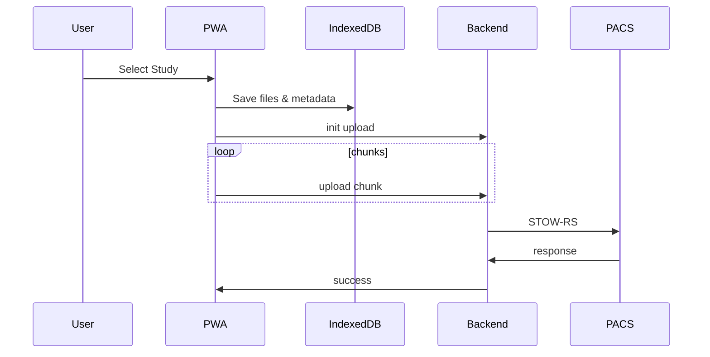
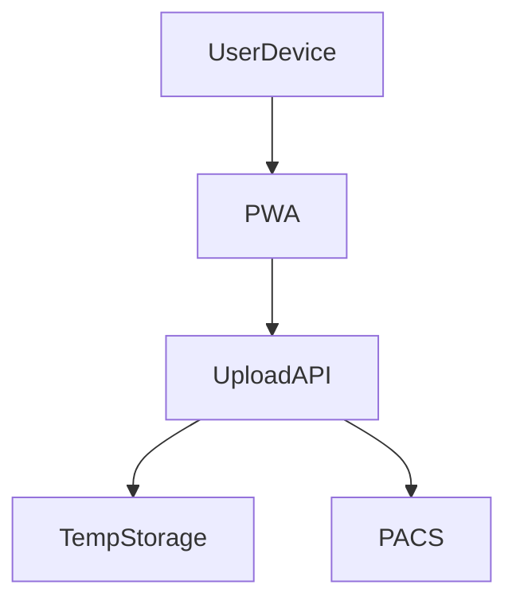

# RelayPACS – Implementation Deep Dive

This document continues directly from the Delivery Pack and covers:
1. Exact API Schemas (OpenAPI-ready)
2. IndexedDB + Service Worker Sync Design
3. Mermaid-Ready Sequence & Architecture Diagrams
4. HIPAA/GDPR MVP Compliance Checklist
5. QR-Based Upload Session Specification

---

## 1. API Schemas (OpenAPI-Ready)

### Auth
**POST /auth/login**
Request:
- username
- password

Response:
- access_token (JWT)
- expires_in

---

### Initialize Upload Session
**POST /upload/init**
Headers:
- Authorization: Bearer <JWT>

Request:
- study_metadata
- total_files
- total_size_bytes

Response:
- upload_id
- upload_token (short-lived)
- chunk_size

---

### Upload Chunk
**PUT /upload/{upload_id}/chunk**
Headers:
- Authorization: Bearer <upload_token>

Request:
- chunk_index
- file_id
- binary_payload

Response:
- received_chunk_index

---

### Complete Upload
**POST /upload/{upload_id}/complete**
Headers:
- Authorization: Bearer <upload_token>

Response:
- status: success | partial | failed
- pacs_receipt_id
- warnings[]

---

### Upload Status
**GET /upload/{upload_id}/status**
Response:
- progress_percent
- uploaded_bytes
- state

---

## 2. IndexedDB + Service Worker Sync Design

### IndexedDB Schema

StudyStore
- id
- metadata
- clinical_notes
- status
- retry_count

FileStore
- id
- study_id
- blob
- size

ChunkStore
- file_id
- chunk_index
- uploaded (bool)

---

### Sync Algorithm (Pseudocode)
1. Detect connectivity
2. Select queued studies
3. For each file → chunk
4. Upload next missing chunk
5. Persist chunk state
6. On failure → backoff + retry
7. On completion → cleanup

---

## 3. Mermaid-Ready Diagrams

### Upload Sequence

---

### High-Level Architecture

---

## 4. HIPAA / GDPR MVP Compliance Checklist

### Data Minimization
- No long-term PHI storage
- Auto-delete temp files

### Security Controls
- HTTPS only
- Token-based auth
- Short-lived upload tokens

### Auditability
- Upload logs (no image data)
- Timestamped events

### User Rights (GDPR)
- Right to deletion (automatic)
- No secondary data use

---

## 5. QR-Based Upload Session Specification

### Goal
Allow zero-configuration secure uploads.

### Flow
1. Admin generates QR with:
   - PACS endpoint ID
   - One-time upload token
2. Clinician scans QR
3. PWA auto-configures session
4. Token expires after use

### QR Payload (Example)
- endpoint_id
- upload_token
- expires_at

### Security
- Single-use token
- Time-limited
- Scope-limited to upload

---

## End State
This document fully specifies RelayPACS down to API, sync logic, compliance posture, and advanced onboarding—sufficient for implementation, review, and regulated deployment.
