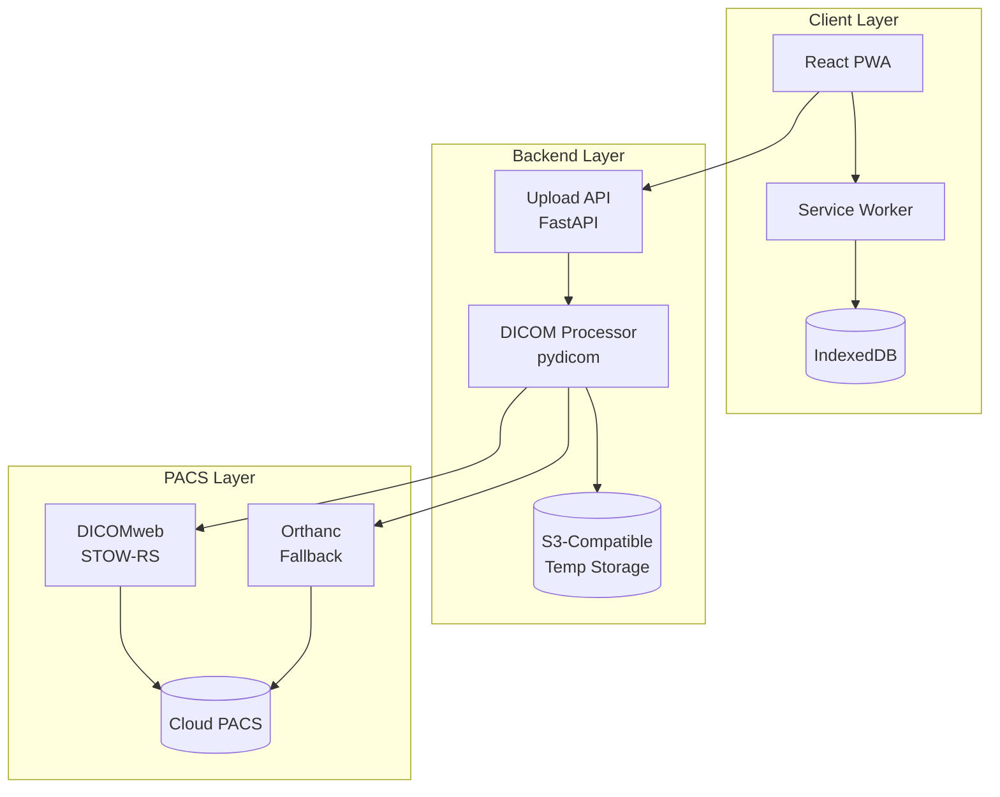

# RelayPACS: Comprehensive Implementation & Build Plan

## Executive Summary

**RelayPACS** is a mobile-first Progressive Web Application (PWA) designed to serve as a lightweight DICOM ingestion node for teleradiology and remote clinic environments. The system enables secure, offline-capable upload of medical imaging studies (DICOM, JPEG, PNG, ZIP/RAR archives) from mobile devices, tablets, or PCs directly to a cloud PACS infrastructure.

**Core Value Proposition:**
- **Offline-First Architecture**: Zero data loss even in low-connectivity environments
- **Mobile-Optimized UX**: Single-action workflow designed for non-technical users
- **PACS-Native Integration**: Standards-compliant DICOMweb (STOW-RS) forwarding
- **Minimal Infrastructure**: Stateless design with no long-term PHI storage

**Target Timeline**: 3 weeks (3 one-week sprints)
**Target Deployment**: Pilot-ready MVP for clinical validation

---

## 1. System Architecture Overview

### 1.1 High-Level Architecture



### 1.2 Component Responsibilities

| Component | Responsibility | Technology |
|-----------|---------------|------------|
| **React PWA** | UI, file intake, metadata preview | React, TypeScript, Vite |
| **Service Worker** | Offline queue, background sync | Workbox |
| **IndexedDB** | Persistent upload state | Dexie.js |
| **Upload API** | Chunked upload handling, auth | FastAPI, Python 3.11+ |
| **DICOM Processor** | Validation, SC wrapping | pydicom |
| **Temp Storage** | Short-lived file storage | MinIO / S3 |
| **PACS Adapter** | DICOMweb forwarding | dicomweb-client |

---

## 2. Technology Stack

### 2.1 Frontend Stack

```yaml
Core Framework: React 18+ with TypeScript
Build Tool: Vite 5+
PWA Tools:
  - Workbox 7+ (service worker, background sync)
  - vite-plugin-pwa
State Management: React Context + local state
Database: IndexedDB via Dexie.js 4+
DICOM Parsing: cornerstone-core (metadata only)
HTTP Client: axios with upload progress tracking
File Handling:
  - JSZip (client-side unzip)
  - FileSaver.js (future export)
```

### 2.2 Backend Stack

```yaml
Framework: FastAPI 0.109+
Runtime: Python 3.11+
ASGI Server: Uvicorn with uvloop
DICOM Processing:
  - pydicom 2.4+
  - dicomweb-client 0.59+
Authentication: python-jose (JWT)
Storage: boto3 (S3-compatible)
Validation: pydantic 2.0+
Testing: pytest, pytest-asyncio
```

### 2.3 Infrastructure & DevOps

```yaml
Containerization: Docker + Docker Compose
Frontend Hosting: Vercel / Netlify (CDN)
Backend Hosting: AWS ECS / Google Cloud Run
Temp Storage: MinIO (dev) → S3 (prod)
CI/CD: GitHub Actions
PACS Testbed: Orthanc Docker image
Monitoring: Structured JSON logging
```

---

## 3. Three-Week Sprint Roadmap

### Sprint 0: Foundations (Days 1-4)
- Repository setup and CI/CD pipeline
- FastAPI backend skeleton with auth
- React PWA scaffolding with service worker
- IndexedDB schema design
- Docker Compose development environment
- **Deliverable**: Running dev environment

### Sprint 1: Core Upload Flow (Days 5-11)
- Backend: Upload session management, chunking, temp storage
- Frontend: File selection, metadata extraction, upload UI
- DICOM validation logic
- Progress tracking (online only)
- **Deliverable**: End-to-end online upload

### Sprint 2: Offline & Resumable (Days 12-18)
- IndexedDB upload queue persistence
- Service worker background sync
- Idempotent chunk handling
- Auto-resume on network recovery
- **Deliverable**: Zero data loss uploads

### Sprint 3: PACS Integration (Days 19-21)
- DICOMweb STOW-RS implementation
- Orthanc fallback adapter
- Security hardening (HTTPS, rate limiting)
- Temp file cleanup automation
- **Deliverable**: Pilot-ready system

---

## 4. API Specification Summary

### Authentication
- `POST /auth/login` - JWT authentication
- Returns access token and upload-scoped tokens

### Upload Lifecycle
- `POST /upload/init` - Initialize upload session
- `PUT /upload/{id}/chunk` - Upload file chunks
- `POST /upload/{id}/complete` - Finalize upload
- `GET /upload/{id}/status` - Query upload progress

---

## 5. Security & Compliance

### HIPAA Alignment
- TLS 1.3 encryption in transit
- AES-256 encryption at rest
- JWT-based access control
- 24-hour auto-deletion of temp files
- No long-term PHI storage
- Structured audit logging

### STRIDE Threat Mitigation
- **Spoofing**: JWT authentication
- **Tampering**: Chunk checksums
- **Repudiation**: Timestamped logs
- **Information Disclosure**: HTTPS, no frontend persistence
- **Denial of Service**: Rate limiting, size caps
- **Elevation of Privilege**: Single-use tokens

---

## 6. Testing Strategy

### Unit Tests
- Backend: pytest (85%+ coverage target)
- Frontend: Vitest (80%+ coverage target)

### Integration Tests
- E2E: Playwright tests for all user flows
- PACS integration tests with Orthanc

### Manual Testing
- Mobile device testing (Android/iOS)
- Network condition simulation (2G throttling)
- Usability testing with target users

---

## 7. Deployment Architecture

**Development**: Docker Compose (frontend, backend, MinIO, Orthanc)
**Staging**: Vercel + Cloud Run + GCS
**Production**: CDN + Auto-scaling containers + S3

---

## 8. Success Criteria

- ✅ Upload DICOM studies from mobile devices
- ✅ Queue uploads offline, auto-resume when online
- ✅ Zero data loss on page refresh or network interruption
- ✅ Successfully forward to PACS via DICOMweb
- ✅ Human-readable error messages
- ✅ HIPAA-aligned architecture
- ✅ Support 1 Mbps network connections
- ✅ Touch targets ≥44px for mobile accessibility

---

## 9. Sprint 2 Detailed Plan: Offline & Resumable Uploads

### 9.1 Backend Resilience
- **Status Endpoint Enhancement**: Update `GET /upload/{id}/status` to return a `missing_chunks` array, allowing the client to intelligently resume without re-uploading existing data.
- **Idempotency**: Ensure `PUT /upload/{id}/chunk` checks for existing chunks on disk/S3 before processing, returning `204 No Content` if already present.
- **Session Persistence**: Transition session state from in-memory to a persisted JSON file (as a fallback for Redis) to ensure session survival across server restarts.

### 9.2 Frontend Offline Strategy
- **Background Sync**: Integrate Workbox `BackgroundSyncPlugin` to automatically retry failed upload requests (init/complete) when the device reconnects.
- **Network Awareness**: Implement a `useNetworkStatus` hook to toggle UI states and pause/resume active uploads gracefully.
- **Queue Persistence**: Ensure the `files` and `chunks` tables in IndexedDB are used as the source of truth, allowing the app to reload and "continue where it left off" even after a browser crash.

### 9.3 Verification Plan (Sprint 2)
- **Simulated Offline**: Using DevTools to throttle/cut network during an active upload.
- **Manifest Validation**: Verifying the server-side chunk manifest matches the client-side queue.
- **Browser Reload Test**: Navigating away or refreshing the page mid-upload to verify auto-resumption.

---
## Reference Documents

All specification documents located in: `/home/ubuntu-desk/Desktop/Teleradiology/geteway/`

1. [PRD](file:///home/ubuntu-desk/Desktop/Teleradiology/geteway/prd_mobile_dicom_ingestion_pwa.md)
2. [Technical Design](file:///home/ubuntu-desk/Desktop/Teleradiology/geteway/technical_design_specification_relay_pacs_mobile_dicom_ingestion_node.md)
3. [UI/UX Specification](file:///home/ubuntu-desk/Desktop/Teleradiology/geteway/ui_ux_design_specification_relay_pacs_mobile_dicom_ingestion_pwa.md)
4. [Implementation Deep Dive](file:///home/ubuntu-desk/Desktop/Teleradiology/geteway/implementation_deep_dive_apis_sync_engine_diagrams_compliance_qr_sessions.md)
5. [Sprint Planning](file:///home/ubuntu-desk/Desktop/Teleradiology/geteway/sprint_planning_implementation_plan_relay_pacs_mvp.md)
6. [Delivery Pack](file:///home/ubuntu-desk/Desktop/Teleradiology/geteway/delivery_pack_relay_pacs_epics_issues_flows_apis_wireframes.md)
7. [Engineering Hardening](file:///home/ubuntu-desk/Desktop/Teleradiology/geteway/engineering_hardening_reference_skeleton_threat_model_pacs_compatibility.md)
8. [UX Acceptance Criteria](file:///home/ubuntu-desk/Desktop/Teleradiology/geteway/ux_acceptance_criteria_usability_test_script_relay_pacs.md)
